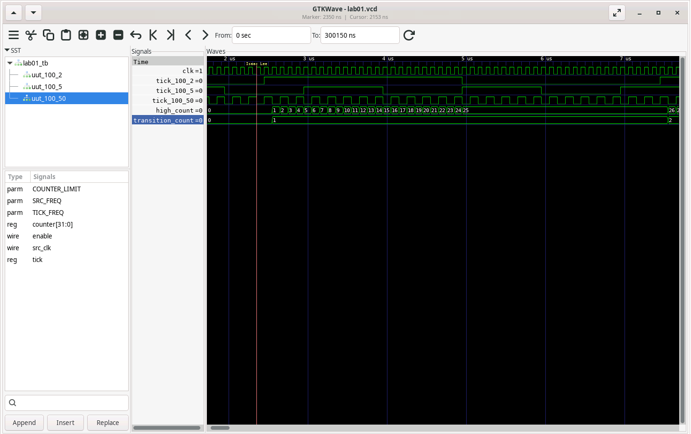

# Lab 1 Report  
**Name:** Isaac Lee  
**Email:** ilee002@ucr.edu  

## Test Cases  
1. **Test Case 1 (SRC_FREQ=100, TICK_FREQ=2)**  
   - **Expected:**  
     - 50% duty cycle (500 cycles HIGH / 1000 total).  
     - 20 transitions (2 Hz × 10 seconds).  
   - **Result:** PASSED.  

2. **Test Case 2 (SRC_FREQ=100, TICK_FREQ=5)**  
   - **Expected:**  
     - 50% duty cycle.  
     - 50 transitions (5 Hz × 10 seconds).  
   - **Result:** PASSED.  

3. **Test Case 3 (SRC_FREQ=100, TICK_FREQ=50)**  
   - **Expected:**  
     - 50% duty cycle.  
     - 500 transitions (50 Hz × 10 seconds).  
   - **Result:** FAILED, 499 Transitions.  

## Waveform Screenshot  
  

